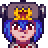
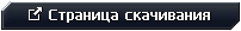
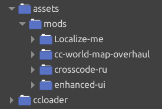

#  crosscode-ru

Комьюнити-мод русского перевода игры [CrossCode](https://cross-code.com/en/home), который мы все
заслужили.

**Наш веб-сайт**: https://crosscode.ru/ \
**Наш Discord-сервер**: https://crosscode.ru/discord (https://discord.com/invite/QANXNbR) \
**Наша группа в VK**: https://vk.com/crusscode

## Важная заметка о сообществе

Discord-сервер русского сообщества нынче заморожен и заархивирован: туда нельзя ничего писать, а сам
он является музеем. Но команда переводчиков создала новый сервер, не связанный с тематикой
CrossCode, зайти на него можно по ссылке:

https://discord.gg/P9hKbZkYym

Тем не менее, поддержка мода не заканчивается. Если есть вопросы об игре или переводе, или вы
столкнулись с какой-нибудь проблемой, или если просто хочется поболтать - обращайтесь на этом новом
сервере.

## Краткая инструкция по установке

[Открыть подробную инструкцию](#подробная-инструкция-по-установке)

1. Перейдите на страницу последней версии перевода нажатием по этой кнопке:

   

   и там щёлкните по гигантской кнопке "Скачать!".

2. Распакуйте (с заменой) файлы из скачанного архива прямо в папку игры
   ([**где искать папку игры???**](#шаг-2-определите-путь-к-папке-игры)).

3. Запустите игру, откройте настройки, выберите русский язык.

4. Выйдете из игры и затем перезапустите её.

5. Всё готово! Удачи и приятной игры!

## Инструкция по обновлению

В принципе, Вы можете просто повторить шаги из
[инструкции по установке](#краткая-инструкция-по-установке): скачать новую версию перевода и
распаковать её с заменой файлов, что перезапишет все файлы предыдущей версии. Но я рекомендую
сначала удалить из папки игры вот эти все папки, связанные с переводом:

## Фичи

Нажмите на любое изображение, чтобы открыть его в полном размере.

<table>
<tbody>
<tr>
<td align="center" colspan="2"><strong>Перевод всей игры и её интерфейса на русский</strong></td>
</tr>
<tr>
<td align="center" width="50%"></td>
<td align="center" width="50%"></td>
</tr>
<tr>
<td align="center" width="50%"></td>
<td align="center" width="50%"></td>
</tr>
<tr>
<td align="center" colspan="2"><strong>Множество различных исправлений багов интерфейса</strong></td>
</tr>
<tr>
<td align="center" width="50%"> Например, бегущие строки</td>
<td align="center" width="50%"> Локализация текстур (опционально)</td>
</tr>
<tr>
<td align="center" width="50%"> До применения бегущих строк</td>
<td align="center" width="50%"> После (простите, в этот раз без гифки)</td>
</tr>
<tr>
<td align="center" colspan="2"><strong>Улучшенная карта мира</strong></td>
</tr>
<tr>
<td align="center" colspan="2"></td>
</tr>
</tbody>
</table>

## Подробная инструкция по установке

Обновляетесь на новую версию? Сначала взгляните на
[инструкцию по обновлению](#инструкция-по-обновлению).

### Шаг 1. Скачивание перевода

**ВНИМАНИЕ!!! Пожалуйста, внимательно читайте, что и куда надо скачивать!**

Перейдите на страницу
[последней версии](https://github.com/CCDirectLink/crosscode-ru/releases/latest) нажатием по этой
кнопке:

и либо **щёлкните по огромной кнопке "Скачать!"**, которая автоматически скачает то, что надо, либо
вручную скачайте архив с именем `crosscode-ru_quick-install_vX.Y.Z.zip` (или
`crosscode-ru_quick-install_vX.Y.Z.tgz`, если вам не нравится `.zip`). Этот архив содержит сам мод
русского перевода, все остальные необходимые для его работы моды, плюс загрузчик модов
[CCLoader](https://github.com/CCDirectLink/CCLoader).

### Шаг 2. Определите путь к папке игры

Путь будет отличаться в зависимости от операционной системы и метода установки игры. В случае, если
вы купили игру в Steam - это проще простого. Кликните правой кнопкой мыши по игре в библиотеке,
выберите во всплывшем меню пункт "Управление", затем кликните по пункту "Просмотреть локальные
файлы":

Это откроет папку установки в проводнике. Как правило, у Steam эта папка расположена в:

| Операционная система | Путь к папке установки                                           |
| -------------------- | ---------------------------------------------------------------- |
| **MS Windows**       | `C:\Program Files\Steam\steamapps\common\CrossCode`              |
| **macOS**            | `~/Library/Application Support/Steam/steamapps/common/CrossCode` |
| **GNU/Linux**        | `~/.local/share/Steam/steamapps/common/CrossCode`                |

Если же Вы решили пойти по благородному пути пиратства, то, думаю, Вы знаете, чем занимаетесь, ну и
куда установлена игра тоже.

<strong>Пользователям macOS требуется совершить ещё несколько действий (нажмите, чтобы развернуть)</strong>

На macOS папка игры расположена внутри установленного приложения. Для перехода в неё надо сделать
следующее:

1. После открытия через Steam папки с локальными файлами игры, нажмите правой кнопкой мыши на
   приложение `nwjs` или `CrossCode`
2. Выберите в контекстном меню пункт "Показать содержимое пакета"
   
3. Перейдите в папку `Contents`, затем в `Resources`
4. Папка игры находится в `app.nw`
   

На всякий случай, вот каким образом выглядит папка игры:

<strong>MS Windows (нажмите, чтобы развернуть)</strong>

<strong>macOS (нажмите, чтобы развернуть)</strong>

<strong>GNU/Linux (нажмите, чтобы развернуть)</strong>

### Шаг 3. Установка перевода

Распакуйте файлы из архива прямо в папку игры:

Замены требует только один файл - `package.json`:

### Шаг 4. Первый запуск игры

После запуска игры перейдите в меню "Options". Если вы всё сделали правильно - в опции выбора языка
(вкладка "General") появится пункт "Russian":

**ВНИМАНИЕ!!! После выбора "Russian" перезапустите игру!!!**

### Шаг 5. Второй запуск игры и выбор опций мода

Теперь изменения языка игры применены. Вы также можете изменить несколько дополнительных опций,
которые, собственно, добавляет мод перевода:

- **Локализация текстур** - Включает переведённые надписи на спрайтах, например, на табличках в
  игровом мире. Включена по-умолчанию.
- **Перевод имени "Lea"** - _Лея:_ Более естественно звучащий вариант. _Лиа:_ Сохраняет каноническое
  произношение. Данная опция призвана разрешить древний холивар двух враждующих групп переводчиков.
  Тем не менее, по-умолчанию выбран вариант _"Лея"_.

**ВНИМАНИЕ!** Изменение любой из этих двух опций требует перезапуска игры!

Также стоит упомянуть, какие моды включены в состав перевода. Вы можете включать и выключать
установленные моды в меню "Моды", при свежей установке это меню будет выглядеть так:

Краткие описания функционала каждого мода:

- **crosscode-ru** _(не выключать!)_ - Русский перевод CrossCode собственной персоной, главный мод в
  модпаке, содержит файлы (пакеты) с переводами строк и исправления интерфейса _специфичные_ для
  русского языка.
- **Ultimate Localized UI** _(не выключать!)_ - Общие улучшения и исправления интерфейса
  пользователя, разработан и _требуется_ для crosscode-ru, но теперь используется также и в других
  проектах перевода CrossCode.
- [**Localize Me**](https://github.com/L-Sherry/Localize-me#readme) _(не выключать!)_ - Мод для
  добавления новых языков в игру, внедрения переводов и изменения прочих региональных настроек,
  просто _необходим_ для работы crosscode-ru.
- [**World map overhaul**](https://github.com/dmitmel/cc-world-map-overhaul#readme)
  _(опционально)_ - Улучшенная карта мира, нарисована очень-очень давно одним из ключевых членов
  команды переводчиков.

**ВНИМАНИЕ!** Думаю, что это уже стало очевидным, но после включения или выключения модов требуется
перезапуск игры!

### Шаг 6. Удачи и приятной игры!

## Бонус: Как запустить игру на Android

Инструкцию по этому [можно прочитать тут](docs/android.md).

## Авторы

### Генеральный сборщик

- Dimava

### Программисты мода

- dmitmel
- L-Sherry

### Главный редактор

- Packy

### Редакторы

- Sandorik
- Mystical Kitsune

### Тостеры (тестировщики)

- ElectroPlayer
- Sage the Voity

### Переводчики

- Packy
- Mystical Kitsune
- Sandorik
- dymeon
- MegaGazon
- Dimava
- Dustex
- Rik'Zun
- Death_Gun
- RarityDash
- Sage the Voity
- ArgonLain
- DeSio
- Cilez
- aspadm
- ArchonT3
- MystAxe

### Главный корректор

- dymeon

### Корректоры

- Varenik1226
- Щепыч

### Благодарности

- MrSuperParadox
- Yen
- Настечка
- MystAxe
- WatDuhHekBro
- Notabenoid

## Разные вопросы о легальности

Команда crosscode-ru никак не связана с
[RadicalFishGames](http://www.radicalfishgames.com/?page_id=17). Разрешение на распространение
перевода в таком виде, в котором он сейчас есть, было получено
([ссылка 1](https://discordapp.com/channels/143364538958348288/276459212807340034/676870708613087272),
[ссылка 2](https://discordapp.com/channels/143364538958348288/276459212807340034/676891793417306132)).
Переводы и изображения (ассеты) распространяются под лицензией
[CC-BY-4.0](https://creativecommons.org/licenses/by/4.0/). Код из
[этого репозитория](https://github.com/CCDirectLink/crosscode-ru) распространяется под лицензией
[MIT](https://choosealicense.com/licenses/mit/).
