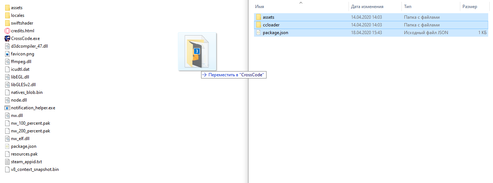
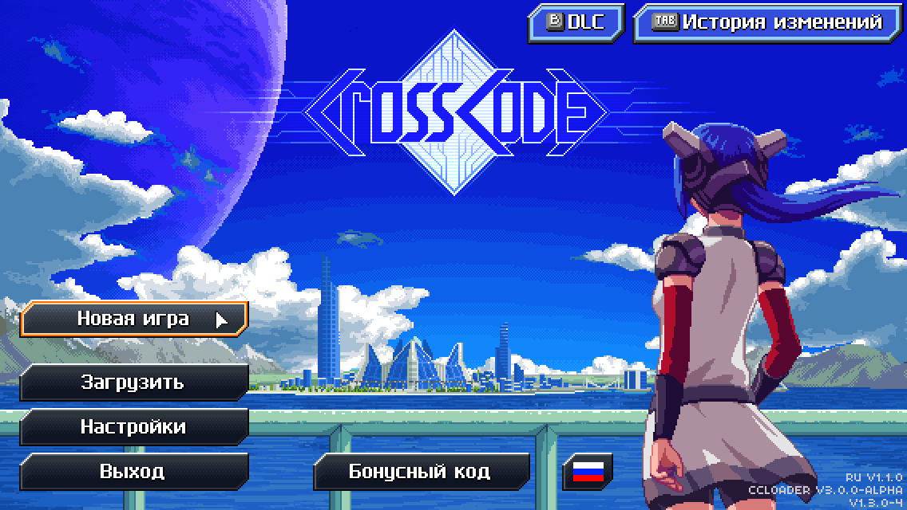

# crosscode-ru

Work in progress! Coming soon.

## Инструкции по установке

Обновляетесь на новую версию? Сначала просмотрите [инструкции по обновлению](#инструкции-по-обновлению)

### Шаг 1. Определите путь к папке игры

Путь может отличаться в зависимости от операционной системы и метода установки игры. Папка игры выглядит следующим образом:

**MS Windows:**


**macOS:**


**GNU/Linux:**


#### Steam

Для определения пути можно воспользоваться встроенным меню "локальные файлы" в свойствах игры:


Обычно папка, в которую Steam устанавливает игру, расположена в:

- **MS Windows**: `C:\Program Files\Steam\steamapps\common\CrossCode`
- **macOS:** `~/Library/Application Support/Steam/steamapps/common/CrossCode`
- **GNU/Linux:** `~/.local/share/Steam/steamapps/common/CrossCode`

##### Заметка пользователям macOS

На macOS папка игры расположена внутри установленного приложения. Для перехода в неё надо сделать следующее:

1. После открытия через Steam папки с локальными файлами игры, нажмите правой кнопкой мыши на приложение `nwjs` или `CrossCode`
2. Выберите в контекстном меню пункт "Показать содержимое пакета"
   
3. Перейдите в папку `Contents`, затем в `Resources`
4. Папка игры находится в `app.nw`
   

#### Для пиратов

Раз уж Вы решили пойти по благородному пути пиратства то, думаю, Вы знаете, чем занимаетесь, ну и где лежит папка игры тоже.

### Шаг 2. Скачивание модпака

Перейдите на страницу [последнего релиза](https://github.com/dmitmel/crosscode-ru/releases/latest) и скачайте архив с именем `crosscode-ru_quick-install_vX.Y.Z.zip` (или `crosscode-ru_quick-install_vX.Y.Z.tar.gz` если вам не нравится `.zip`). Этот архив уже содержит все моды из русского модпака плюс загрузчик модов [CCLoader](https://github.com/CCDirectLink/CCLoader).

### Шаг 3. Установка модпака

Распакуйте файлы из архива прямо в папку игры:



Замены требует только один файл - `package.json`:


### Шаг 4. Первый запуск игры

После запуска игры перейдите в меню "Options". Если вы всё сделали правильно - в опции выбора языка (вкладка "General") появится пункт "Russian":


**ВНИМАНИЕ!!! После выбора "Russian" перезапустите игру!!!**

### Шаг 5. Второй запуск игры и выбор опций мода


Теперь изменения языка игры применены. Вы также можете изменить несколько дополнительных опций, которые, собственно, добавляет мод перевода:


- **Локализация текстур** - Включает переведённые надписи на спрайтах, например, на табличках в игровом мире. Включена по-умолчанию.
- **Перевод имени "Lea"** - _Лея:_ Более естественно звучащий вариант. _Лиа:_ Сохраняет каноническое произношение. Данная опция призвана разрешить древний холивар двух враждующих групп переводчиков. Тем не менее, по-умолчанию выбран вариант _"Лея"_.

**ВНИМАНИЕ!** Изменение любой из этих двух опций требует перезапуска игры!

Также стоит упомянуть, какие моды включены в состав модпака. Вы можете включать и выключать установленные моды в меню "Моды", при свежей установке модпака crosscode-ru это меню будет выглядеть так:


Краткие описания функционала каждого мода:

- [cc-world-map-overhaul](https://github.com/dmitmel/cc-world-map-overhaul#readme) _(опционально)_ - Улучшенная карта мира
- CCLoader display version _(не выключать!)_ - Отображает версию CCLoader (не спрашивайте, почему это отдельный мод)
- crosscode-ru _(не выключать!)_ - Собственно, русский перевод CrossCode и сопутствующие исправления интерфейса
- Enhanced UI _(не выключать!)_ - Различные улучшения и общие исправления графического интерфейса пользователя (требуется для работы crosscode-ru)
- [Localize Me](https://github.com/L-Sherry/Localize-me#readme) _(не выключать!)_ - Мод для создания дополнительных региональных настроек, языков и переводов (требуется для работы crosscode-ru)

**ВНИМАНИЕ!** Думаю, что это уже стало очевидным, но после включения или выключения модов требуется перезапуск игры!

### Шаг 6. Удачи и приятной игры!



## Инструкции по обновлению

В принципе, вы можете просто повторить все шаги в [инструкции по установке](#инструкции-по-установке) и при распаковке архива перезаписать все установленные файлы. Но всё же, я рекомендую для начала удалить следующие папки в папке игры (папки отмечены `/` в конце):

```
<папка игры>/
├─ assets/
│  └─ mods/
│     ├─ cc-world-map-overhaul/
│     ├─ ccloader-version-display/
│     ├─ crosscode-ru/
│     ├─ enhanced-ui/
│     ├─ Localize-me/
│     └─ simplify/
└─ ccloader/
```

После чего можете спокойно выполнять установку [начиная с шага 2](#шаг-2-скачивание-модпака).
