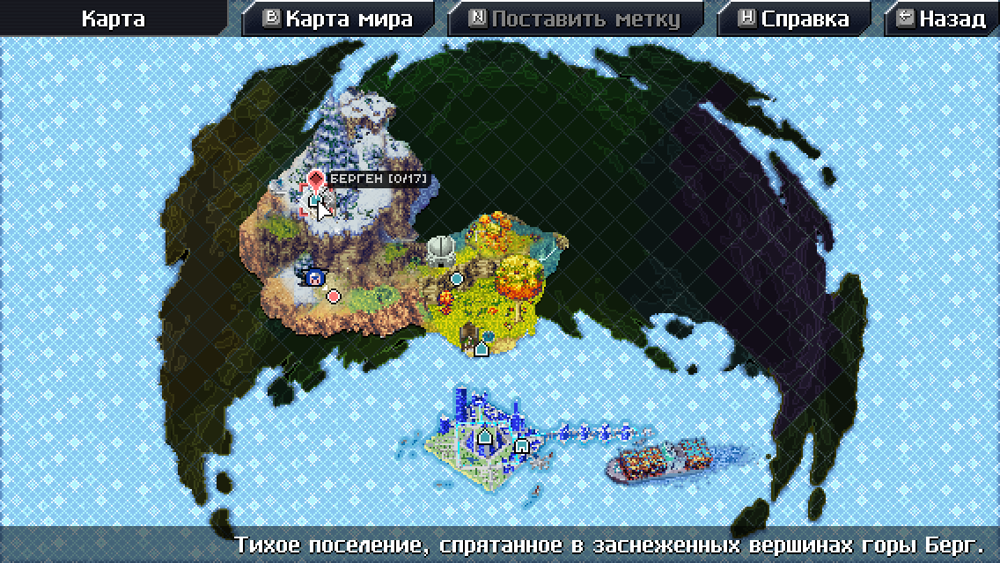
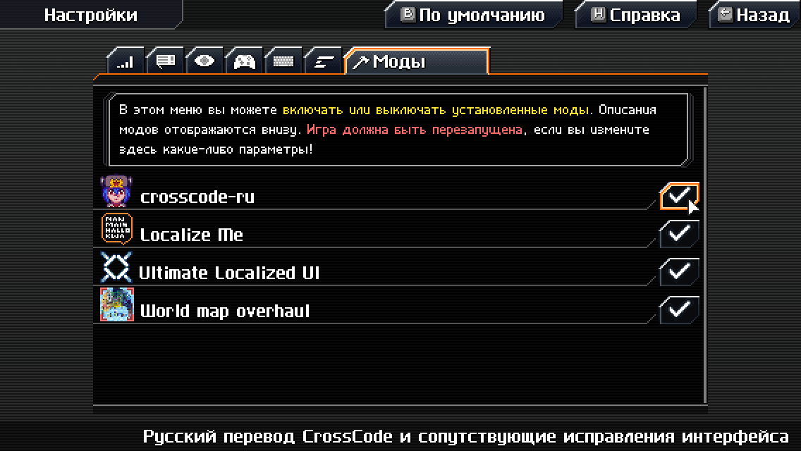

# crosscode-ru

Комьюнити-модпак русского перевода игры [CrossCode](https://cross-code.com/en/home), который мы все заслужили.


**Наш Discord-сервер**: https://crosscode.ru/discord \
**Наша группа в VK**: https://vk.com/crusscode

[**Перейти к инструкции по установке!**](#инструкции-по-установке)

## Фичи

### 1. Собственно, русский перевод CrossCode


### 2. Куча различных исправлений интерфейса

**Например, бегущие строки:**


Или, вот ещё один пример. **Оригинал:**


(простите, в этот раз без гифки) **С фиксом для бегущих строк:**


### 3. Опциональная локализация текстур


### 4. Улучшенная карта мира



## Инструкции по установке

Обновляетесь на новую версию? Сначала просмотрите [инструкции по обновлению](#инструкции-по-обновлению).

### Шаг 1. Определите путь к папке игры

Путь может отличаться в зависимости от операционной системы и метода установки игры. Папка игры выглядит следующим образом:

**MS Windows:**


**macOS:**


**GNU/Linux:**


#### Steam

Для определения пути можно воспользоваться встроенным меню "локальные файлы" в свойствах игры:


Обычно папка, в которую Steam устанавливает игру, расположена в:

- **MS Windows**: `C:\Program Files\Steam\steamapps\common\CrossCode`
- **macOS:** `~/Library/Application Support/Steam/steamapps/common/CrossCode`
- **GNU/Linux:** `~/.local/share/Steam/steamapps/common/CrossCode`

##### Заметка пользователям macOS

На macOS папка игры расположена внутри установленного приложения. Для перехода в неё надо сделать следующее:

1. После открытия через Steam папки с локальными файлами игры, нажмите правой кнопкой мыши на приложение `nwjs` или `CrossCode`
2. Выберите в контекстном меню пункт "Показать содержимое пакета"
   
3. Перейдите в папку `Contents`, затем в `Resources`
4. Папка игры находится в `app.nw`
   

#### Для пиратов

Раз уж Вы решили пойти по благородному пути пиратства, то, думаю, Вы знаете, чем занимаетесь, ну и где лежит папка игры тоже.

### Шаг 2. Скачивание модпака

Перейдите на страницу [последнего релиза](https://github.com/dmitmel/crosscode-ru/releases/latest) и скачайте архив с именем `crosscode-ru_quick-install_vX.Y.Z.zip` (или `crosscode-ru_quick-install_vX.Y.Z.tar.gz` если вам не нравится `.zip`). Этот архив уже содержит все моды из русского модпака плюс загрузчик модов [CCLoader](https://github.com/CCDirectLink/CCLoader).

### Шаг 3. Установка модпака

Распакуйте файлы из архива прямо в папку игры:


Замены требует только один файл - `package.json`:


### Шаг 4. Первый запуск игры

После запуска игры перейдите в меню "Options". Если вы всё сделали правильно - в опции выбора языка (вкладка "General") появится пункт "Russian":


**ВНИМАНИЕ!!! После выбора "Russian" перезапустите игру!!!**

### Шаг 5. Второй запуск игры и выбор опций мода


Теперь изменения языка игры применены. Вы также можете изменить несколько дополнительных опций, которые, собственно, добавляет мод перевода:


- **Локализация текстур** - Включает переведённые надписи на спрайтах, например, на табличках в игровом мире. Включена по-умолчанию.
- **Перевод имени "Lea"** - _Лея:_ Более естественно звучащий вариант. _Лиа:_ Сохраняет каноническое произношение. Данная опция призвана разрешить древний холивар двух враждующих групп переводчиков. Тем не менее, по-умолчанию выбран вариант _"Лея"_.

**ВНИМАНИЕ!** Изменение любой из этих двух опций требует перезапуска игры!

Также стоит упомянуть, какие моды включены в состав модпака. Вы можете включать и выключать установленные моды в меню "Моды", при свежей установке модпака crosscode-ru это меню будет выглядеть так:



Краткие описания функционала каждого мода:

- [World map overhaul](https://github.com/dmitmel/cc-world-map-overhaul#readme) _(опционально)_ - Улучшенная карта мира
- crosscode-ru _(не выключать!)_ - Собственно, русский перевод CrossCode и сопутствующие исправления интерфейса
- Enhanced UI _(не выключать!)_ - Различные улучшения и общие исправления графического интерфейса пользователя (требуется для работы crosscode-ru)
- [Localize Me](https://github.com/L-Sherry/Localize-me#readme) _(не выключать!)_ - Мод для создания дополнительных региональных настроек, языков и переводов (требуется для работы crosscode-ru)

**ВНИМАНИЕ!** Думаю, что это уже стало очевидным, но после включения или выключения модов требуется перезапуск игры!

### Шаг 6. Удачи и приятной игры!


## Инструкции по обновлению

В принципе, вы можете просто повторить все шаги в [инструкции по установке](#инструкции-по-установке) и при распаковке архива перезаписать все установленные файлы. Но всё же, я рекомендую для начала удалить следующие папки в папке игры (папки отмечены `/` в конце):

```
<папка игры>/
├─ assets/
│  └─ mods/
│     ├─ cc-world-map-overhaul/
│     ├─ crosscode-ru/
│     ├─ enhanced-ui/
│     └─ Localize-me/
└─ ccloader/
```

После чего можете спокойно выполнять установку [начиная с шага 2](#шаг-2-скачивание-модпака).

## Авторы

### Генеральный сборщик

- Dimava

### Программисты мода

- dmitmel
- L-Sherry

### Главный редактор

- Packy

### Редакторы

- Sandorik
- MysKa

### Тостеры (тестировщики)

- ElectroPlayer
- Sage the Voity

### Переводчики

- Packy
- Sandorik
- dymeon
- MegaGazon
- Dimava
- Dustex
- Rik'Zun
- Death_Gun
- RarityDash
- Sage the Voity
- ArgonLain
- DeSio
- Cilez
- aspadm
- ArchonT3
- MystAxe

### Главный корректор

- dymeon

### Корректоры

- Varenik1226
- Щепыч

### Благодарности

- MrSuperParadox
- Yen
- Настечка
- MystAxe
- WatDuhHekBro
- Notabenoid

## Разные вопросы о легальности

Команда crosscode-ru никак не связана с [RadicalFishGames](http://www.radicalfishgames.com/?page_id=17). Разрешение на распространение модпака в таком виде, в котором он сейчас есть, было получено ([ссылка 1](https://discordapp.com/channels/143364538958348288/276459212807340034/676870708613087272), [ссылка 2](https://discordapp.com/channels/143364538958348288/276459212807340034/676891793417306132)). Переводы и изображения (ассеты) распространяются под лицензией [CC-BY-4.0](https://creativecommons.org/licenses/by/4.0/). Код из [этого репозитория](https://github.com/dmitmel/crosscode-ru) распространяется под лицензией [MIT](https://choosealicense.com/licenses/mit/).
