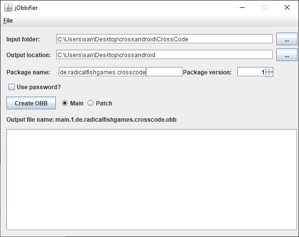

# Инструкция по запуску игры и перевода на Android

Сообществом моддинга CrossCode разработан проект
[CrossAndroid](https://gitlab.com/Namnodorel/crossandroid/), позволяющий запускать игру на
устройствах с Android. Он вносит некоторые изменения в игру, чтоб в неё можно было по-человечески
играть на мобильных устройствах, например, на случай если у Вас нету совместимого с Android
геймпада, CrossAndroid добавляет виртуальный геймпад поверх игры. Также в нём имеется поддержка
модов, соответственно, наш перевод совместим с CrossAndroid, начиная с версии 1.3.5. Ниже описана
процедура установки игры с переводом на Android (которая в основном является переводом
[оригинальной инструкции на английском](https://gitlab.com/Namnodorel/crossandroid/-/blob/master/setup_with_mods.md)).

**ВНИМАНИЕ!** Вся эта система экспериментальна, _теоретически_ игру можно пройти от начала до конца
прямо на смартфоне, но мы это не проверяли.

## Шаг 1. Скачивание приложения CrossAndroid

Для начала, скачайте и установите APK по
[этой ссылке](https://gitlab.com/namnodorel/crossandroid/-/jobs/artifacts/master/raw/app/build/outputs/apk/debug/app-debug.apk?job=assembleDebug).
Запустите приложение и дайте ему разрешение на доступ к хранилищу. Само по себе это приложение пока
что ничего не может сделать - это просто лаунчер, для его работы требуется скопировать файлы игры на
устройство, как это сделать описано далее. В дополнение стоит заметить, что если Вы хотите обновить
игру, или перевод, или установить моды, то это можно сделать без переустановки приложения и потери
данных, следует просто повторить все шаги в этой инструкции, начиная с шага 2.

## Шаг 2. Подготовка файлов игры

Пока что смартфон можно отложить в сторону, все последующие шаги надо выполнять на ПК. Найдите файлы
игры, как это сделать детально описано на [главной страничке](../README.md), и установите перевод.
Затем создайте пустую папку, дальше я буду называть её **"временная папка"**. В ней создайте папку
`CrossCode`, и скопируйте туда папки `assets` и `ccloader` из настоящей папки игры (больше ничего
копировать не надо). После копирования откройте папку `ccloader`, переименуйте находящийся там файл
`main.html` в `index.html` (опять таки, больше ничего трогать не надо, файл `main.css` в
переименовывании не нуждается). По окончанию у вас должна получиться следующая структура файлов:

```
<временная папка>/
└─ CrossCode
   ├─ assets/
   │  ├─ data/
   │  ├─ js/
   │  ├─ media/
   │  ├─ mods/
   │  │  ├─ cc-world-map-overhaul/
   │  │  ├─ crosscode-ru/
   │  │  ├─ enhanced-ui/
   │  │  └─ Localize-me/
   │  └─ ...
   └─ ccloader/
     ├─ common/
     ├─ dist/
     ├─ runtime/
     ├─ index.html
     ├─ main.css
     └─ ...
```

## Шаг 3. Запаковка игры в OBB-файл

Далее игру надо запаковать в специальный файл, который CrossAndroid может прочитать. Для этого
требуется Java и программа jObbifier. Вероятно, Java у вас уже установлена, если нет - перейдите по
этой ссылке: <https://www.java.com/>. Или загуглите что-то в духе
["как установить java"](https://www.google.com/search?q=как+установить+java) - в Интернете есть
полно инструкций по этому, так что не будем на этом зацикливаться.

Скачайте файл `jObbifier.jar` отсюда: <https://github.com/monkey0506/jobbifier/releases/latest>,
положите его во временную папку, рядом с игрой (не внутри папке `CrossCode`), и запустите программу,
дважды кликнув по JAR файлу. Введите в окно jObbifier следующие настройки:

- **Input folder:** путь к папке с подготовленными файлами игры
- **Output location:** путь к временной папке
- **Package name:** `de.radicalfishgames.crosscode`
- **Package version:** `1`
- **Use password?** Нет (просто не ставьте флажок)
- Рядом с кнопкой **Create OBB** выберите `Main`

После этого нажмите на **Create OBB** и подождите минутку. По окончанию процесса запаковки окно
можно закрыть.



## Шаг 4. Копирование файла на устройство с Android

Программа с прошлого шага должна была создать файл `main.1.de.radicalfishgames.crosscode.obb` внутри
временной папки - этот файл CrossAndroid может читать, и его теперь надо переместить на Ваше
устройство. Подключите устройство к ПК по USB, на телефоне появится уведомление с текстом
"Подключено в режиме зарядки". Нажмите на него, выберите пункт "Передача файлов" во всплывшем меню.
Теперь на ПК откройте Проводник, в панели слева (с дисками) появится Ваше Android-устройство.
Откройте его, далее перейдите в папку `Android`, затем `obb`, после чего создайте папку с именем
`de.radicalfishgames.crosscode`, если она не существует. Наконец, скопируйте внутрь этой папки
OBB-файл, получившийся на прошлом шагу.

## Шаг 5. Запуск игры

Откройте приложение CrossAndroid. Если Вы всё сделали правильно - на экране появится кнопка **Launch
CrossCode**. Нажимайте её (игра будет загружаться медленнее, чем на ПК) и следуйте
[инструкции по установке перевода, начиная с шага 4](../README.md#шаг-4-первый-запуск-игры). Если
всё работает - можете удалять временную папку и всё её содержимое. Если нет - смотрите на
[главной странице проекта](../README.md#важная-заметка-о-сообществе), как связаться с нами.
